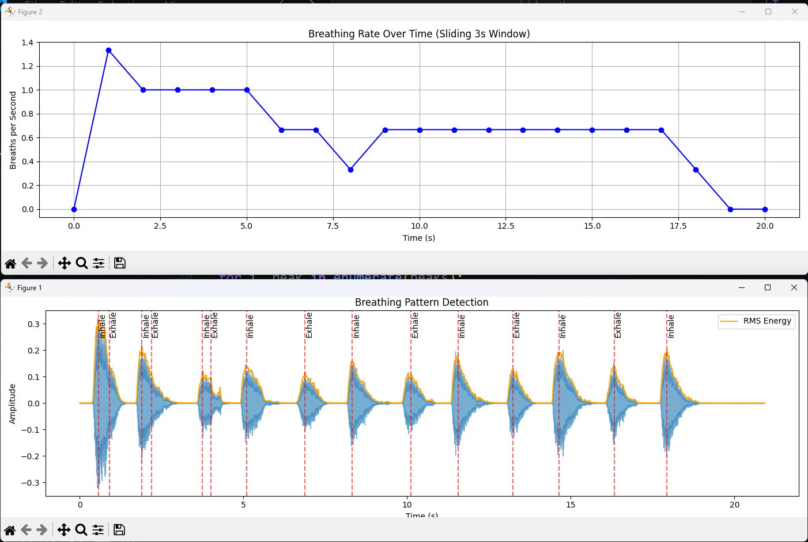
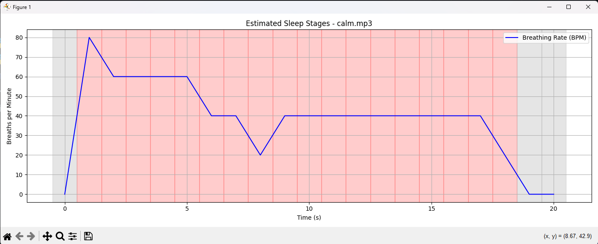
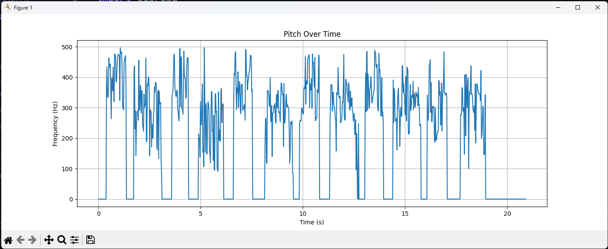
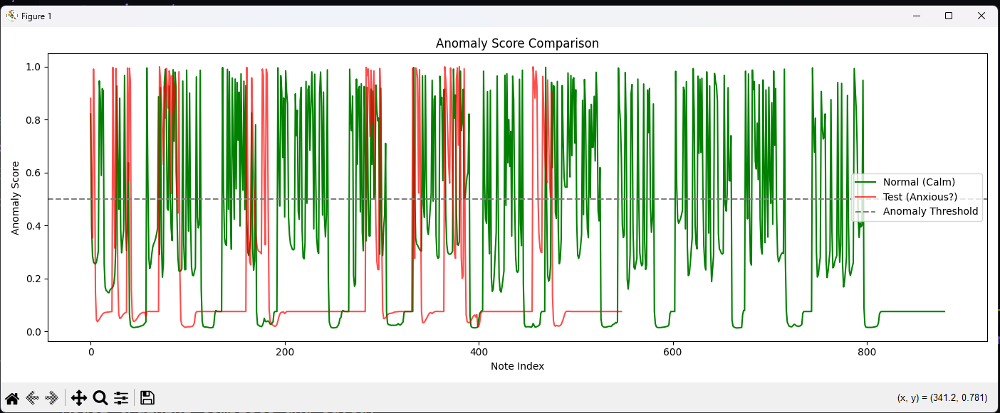

| Breathing Pattern Detection | Sleep Stages Analysis |
|-----------------------------|------------------------|
|  |  |
| Pitch Concept Test | Anomaly Score Comparison |
|  |  |

# Respiratory & Sleep Analysis System  

## Project Description  

This project is a Python-based respiratory and sleep analysis pipeline. It detects breathing cycles, estimates sleep stages, and applies machine learning for anomaly detection. The system maps audio signals (breathing sounds) to both health insights (breathing rate, sleep stages) and musical notes for interpretability.  

The goal is to create an preliminary, testing- tool that bridges signal processing and machine learning for health monitoring.

---

## Motivation  

- Breathing patterns reveal a lot about a person’s health and stress state.  
- Sleep stages are often measured with costly equipment; this project explores a low-cost, audio-based alternative.  
- By experimenting with signal-to-note conversion and anomaly detection, this project explores creative and explainable ways to analyze physiological data.
- In countries where advanced analysis machines are not affordable, this system provides doctors with an accessible way to gain an initial understanding of a patient’s breathing patterns and identify preliminary irregularities.

---

## Why This Project  

- To solve the problem of interpreting raw audio signals in health analysis.  
- To provide visual insights into how breathing changes between calm and anxious states.  
- To build a foundation for real-time stress and sleep monitoring applications.  

---

## Features  

- **Breathing Detection** – Identifies inhale and exhale events, measures breathing rate and intensity  
  *File: `__init__.py`*  

- **Sleep Stage Classification** – Maps breathing rate into stages (Awake/REM, Light Sleep, Deep Sleep)  
  *File: `analyze_sleep.py`*  

- **Note Mapping** – Converts breathing audio into musical note sequences with smoothing for noise reduction  
  *File: `breathing_to_notes.py`*  

- **Anomaly Detection (LSTM)** – Trains on normal breathing and detects anomalies in anxious breathing  
  *Files: `anomaly_score.py`, `note_model.py`*  

- **Database Storage** – Stores structured results in MongoDB for later retrieval and analysis  
  *File: `__init__.py`*  

- **Visualization** – Produces plots for breathing patterns, sleep stages, and anomaly scores.

---

I am continuing to review research papers to identify optimal approaches, as there are more accurate models available. My future plan is to integrate this system with existing datasets and leverage my experience with AI and Retrieval-Augmented Generation (RAG) to achieve more consistent results.

